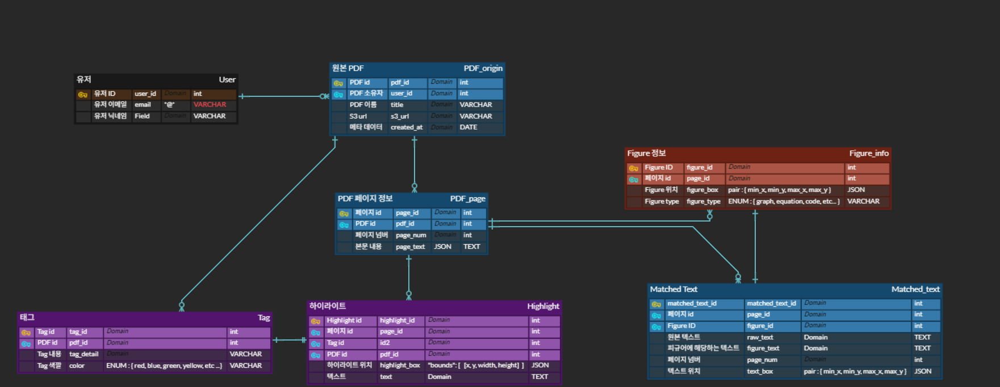
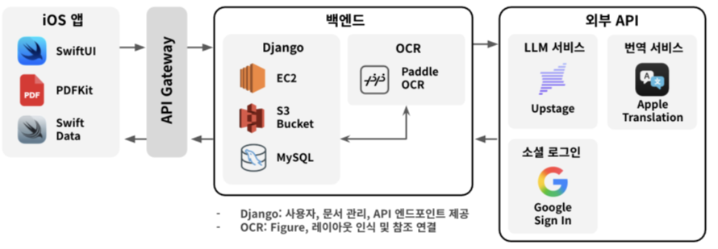

# DOCent Backend (Django)

CAU 캡스톤디자인 프로젝트의 Django 백엔드 레포지토리입니다.

이 백엔드는 사용자가 업로드한 PDF를 **S3에 저장**하고, **S3 Presigned URL**을 생성해 **외부 OCR 서버**에 전달하여 분석 결과(페이지 텍스트/그림/매칭 텍스트)를 DB에 저장합니다.
저장된 데이터는 하이라이트/그림 조회 및 **챗봇 질의**에 활용됩니다.

## Tech Spec

### BE:


### DB:


### Dev-Ops


## API 문서

- Swagger UI: `/swagger/`
- ReDoc: `/redoc/`

## 프로젝트 구조

루트 디렉터리는 `project/` 기준으로 작성했습니다.

```text
project/
	manage.py
	db.sqlite3
	pyproject.toml
	secrets.json

	config/                 # Django project 설정(라우팅/미들웨어/설정)
		settings.py
		urls.py
		asgi.py
		wsgi.py
		middleware.py

	accounts/               # 사용자/인증 (Google 로그인, JWT, 프로필)
		models.py
		urls.py
		views.py
		serializers.py
		swagger.py

	pdf_documents/          # PDF 업로드(S3), OCR 요청/저장, 페이지/텍스트 조회
		models.py
		urls.py
		views.py
		serializers.py

	pdf_figures/            # OCR 결과로 저장된 figure 조회
		models.py
		urls.py
		views.py
		serializers.py

	highlights/             # 태그/하이라이트 CRUD
		models.py
		urls.py
		views.py
		serializers.py

	chatbots/               # 본문 참조 기반 질문 응답(Stateless)
		urls.py
		views.py
		serializers.py

logs/                     # API 로깅 등(운영 보조)
```

## 주요 기능 및 URL

아래 경로들은 [project/config/urls.py]에서 앱 단위로 라우팅됩니다.

### 1) PDF 업로드 → OCR 서버 연동(핵심)

OCR 연동은 단순 CRUD가 아니라, **S3 ↔ OCR 서버** 통신 및 결과 정규화/저장을 수행하는 것이 핵심입니다.

**처리 흐름**

1. 사용자가 PDF 업로드 요청
2. 서버가 PDF를 S3에 업로드하고, `originPDF`(메타데이터 + `s3_key`)를 DB에 저장
3. OCR 요청 시 S3 **Presigned URL**을 생성해 OCR 서버로 전달
4. OCR 서버 응답(`pages`, `figures`, `matches`)을 파싱하여 DB에 저장
5. 이후 figure/매칭 텍스트/하이라이트/챗봇 기능에서 재사용

**Endpoints**

- `POST /pdf_documents/upload/`
  - PDF 파일을 S3에 업로드하고 DB에 메타데이터를 저장합니다.
  - `multipart/form-data` (`title`, `file`) + JWT 인증 필요

- `POST /pdf_documents/pdfs/{pdf_id}/ocr/`
  - S3 Presigned URL을 생성한 뒤 OCR 서버로 요청을 보내고, 결과를 DB에 저장합니다.
  - 저장 대상: `PDFpage`(pages), `PDFfigure`(figures), `MatchedText`(matches)

- `GET /pdf_documents/pdfs/{pdf_id}/pages/`
  - OCR 결과로 저장된 페이지(PDFpage) 목록을 조회합니다.

- `GET /pdf_documents/pdfs/{pdf_id}/matched-texts/`
  - figure와 연결된 매칭 텍스트(MatchedText) 목록을 조회합니다.

- `GET /pdf_documents/pdfs/{pdf_id}`
  - PDF 메타데이터(originPDF)를 조회합니다.

- `GET /pdf_documents/all/`
  - 로그인 유저가 소유한 PDF 목록을 조회합니다.

- `DELETE /pdf_documents/delete/{id}/`
  - S3 객체 및 DB 레코드를 삭제합니다.

### 2) Figure 조회 (OCR 결과 기반)

- `GET /pdf_figures/figures/{pdf_id}/`
  - 특정 PDF에 속한 figure 목록을 조회합니다.
  - OCR 처리 이후(figure 저장 이후) 사용되는 조회 API입니다.

### 3) 하이라이트/태그

- `GET|POST /highlights/tags/`
  - Tag 조회/생성 (`?pdf_id=`로 필터 가능)
- `PUT|DELETE /highlights/tags/{pk}/`
  - Tag 수정/삭제
- `POST /highlights/highlight/`
  - Highlight 생성
- `PUT|DELETE /highlights/highlight/{pk}/`
  - Highlight 수정/삭제
- `GET /highlights/highlights/{pdf_id}/`
  - 특정 PDF에 연결된 Highlight 목록 조회

### 4) 챗봇 (Stateless)

- `POST /chatbots/ask/`
  - 질문(`question`)과 함께 참고자료(figure_ids, highlight_ids, selected_texts)를 받아 답변을 생성합니다.
  - 서버에 대화 히스토리를 저장하지 않는 **Stateless** 형태이며, OCR 결과(MatchedText)와 하이라이트를 문맥으로 구성해 모델 호출에 사용합니다.

### 5) 인증/계정

- `POST /accounts/google/login/`
  - Google ID Token 기반 로그인/회원가입 및 JWT 발급
- `POST /accounts/logout/`
  - refresh 토큰 블랙리스트 처리
- `POST /accounts/token/refresh/`, `POST /accounts/token/verify/`
  - JWT 갱신/검증
- `GET|PUT|PATCH /accounts/me/`
  - 내 프로필 조회/수정

## 배포 환경(요약)

- AWS EC2 (Ubuntu 22.04)
- AWS RDS (MySQL)
- AWS S3 (PDF 파일 저장)

## secrets.json 설정 (중요)

본 프로젝트는 [project/config/settings.py](project/config/settings.py)에서 `secrets.json`을 읽어 런타임 설정을 구성합니다.
즉, DB 접속 정보, AWS 키, OCR 서버 주소, 외부 API 키 등 민감 정보는 `secrets.json`에 저장되어야 합니다.

### 1) secrets.json 파일 위치

- 위치: `project/secrets.json`

### 2) secrets.json 예시 (템플릿)

아래는 **키 이름(스키마)** 참고용 예시입니다. 실제 값은 환경에 맞게 채워주세요.

```json
{
  "SECRET_KEY": "<django-secret-key>",

  "RDS_HOST": "<rds-endpoint>",
  "RDS_PORT": "<rds-port-number>",
  "RDS_DB_NAME": "<db-name>",
  "RDS_USERNAME": "<db-username>",
  "RDS_PASSWORD": "<db-password>",

  "GOOGLE_CLIENT_ID_WEB": "<google-oauth-client-id>",
  "GOOGLE_CLIENT_SECRET_WEB": "<google-oauth-client-secret>",

  "AWS_ACCESS_KEY_ID": "<aws-access-key-id>",
  "AWS_SECRET_ACCESS_KEY": "<aws-secret-access-key>",
  "AWS_STORAGE_BUCKET_NAME": "<s3-bucket-name>",

  "OCR_SERVER": "https://<ocr-server-host>/...",
  "UPSTAGE_API_KEY": "<upstage-api-key>"
}
```

### 3) Django SECRET_KEY 생성 방법

가상환경 활성화 후, 아래 명령으로 안전한 키를 생성할 수 있습니다.

```bash
python -c "from django.core.management.utils import get_random_secret_key; print(get_random_secret_key())"
```

### 4) 보안 주의사항

- `secrets.json`은 민감 정보가 포함되므로 Git에 커밋하지 않는 것을 권장합니다. (예: `.gitignore`에 추가)
- 운영 환경에서는 가능하면 AWS Parameter Store/Secrets Manager 또는 환경변수 기반으로 분리하는 구성이 안전합니다.

## ERD



## Architecture



## 개선할 점

1. Queue(Broker)을 이용한 비동기 처리 방식 도입

- 사용자가 올린 PDF의 처리 시간이 5분을 넘어갈 경우 500 Error가 반환됨. (동기식의 한계)
- Redis를 이용하여 Broker을 배치하고 Celery를 이용하여 비동기로 리팩토링 (GDG 프로젝트에서 연계)

2. 과도한 트래픽 문제 (OCR 처리 용량 한계)

- nginx 등과 같이 load balancer을 배치하여도 OCR 서버의 GPU 및 RAM resource 한계로 인해 해결이 힘들 것 같음.
